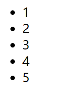
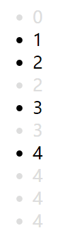
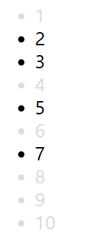
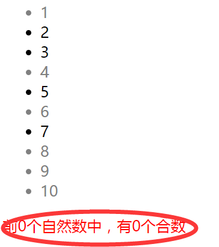
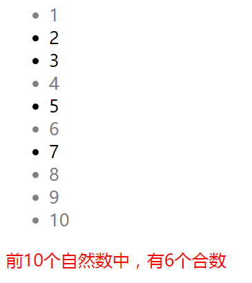
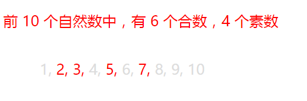

# 使用 CSS 来做素数判定

## 前情提要

此文内容涉及：

* 素数的判定与筛选
* CSS 计数器及其作用域
* 伪元素
* 生成内容
* 层叠样式
* flex

## 突发奇想

某天在查 `nth-child` 伪类的时候，突然想到，既然 `nth-child` 伪类可以选择**处于某个数的所有倍数位置**上的元素，那是不是可以用来做素数判定呢？

如果我把所有数除自己以外的倍数位置上的元素都选中，剩下的不就是素数了嘛。

这么有意思的事情，想到就立马开始行动了，于是我写出了第一版代码：

```html
<style>
  li:first-child {
    color: grey;
  }
  li:nth-child(2n + 2) {
    color: grey;
  }
  li:nth-child(3n + 3) {
    color: grey;
  }
  li:nth-child(4n + 8) {
    color: grey;
  }
  li:nth-child(5n + 10) {
    color: grey;
  }
</style>
<ul>
  <li>01</li>
  <li>02</li>
  <li>03</li>
  <li>04</li>
  <li>05</li>
  <li>06</li>
  <li>07</li>
  <li>08</li>
  <li>09</li>
  <li>10</li>
</ul>
```

上面这段代码让所有非素数位置上的元素的颜色变为灰色。

注意 `nth-child` 伪类的参数是 `Xn + 2X`，而不是 `Xn + X`，这是因为 n 是从 0 开始的。而我们是想要选中的是所有 X 的倍数，但不包含 X 自己。所以最小需要选中的的数即是 2X。另外我们只需要写到 `5n + 10` 即可，因为 6 的倍数已经大于 10 了。

上面所有的选择器的声明块都是一样的，于是可以把所有的选择器合成一个：

```html
<style>
  li:first-child,
  li:nth-child(2n + 4),
  li:nth-child(3n + 6),
  li:nth-child(4n + 8),
  li:nth-child(5n + 10) {
    color: grey;
  }
</style>
<ul>
  <li>01</li>
  <li>02</li>
  <li>03</li>
  <li>04</li>
  <li>05</li>
  <li>06</li>
  <li>07</li>
  <li>08</li>
  <li>09</li>
  <li>10</li>
</ul>
```

这样看起来就清爽多了。

## 让素数项高亮，合数项低亮

不过问题来了：如果我们想要让所有素数项全部高亮的话，该怎么做呢？上面代码中的选择器并没有选中素数项。

容易，我们让所有的项都变成红色，但让非素数项变成灰色，因为选中非素数项的那些选择器的优先级更高，就实现了素数项的高亮。

```html
<style>
  /*优先级为 0,0,0,1*/
  li {
    color: red;
  }

  /*优先级为 0,0,1,1*/
  li:first-child,
  li:nth-child(2n + 4),
  li:nth-child(3n + 6),
  li:nth-child(4n + 8),
  li:nth-child(5n + 10) {
    color: grey;
  }
</style>
<ul>
  <li>01</li>
  <li>02</li>
  <li>03</li>
  <li>04</li>
  <li>05</li>
  <li>06</li>
  <li>07</li>
  <li>08</li>
  <li>09</li>
  <li>10</li>
</ul>
```

然而问题又来了，如果我们想要用这种方式高亮出 100 以内的所有素数，第二条选择器岂不是要写 50 行？

## 减少选择器的条数

通过观察我们可以发现，`li:nth-child(4n + 8)` 这条选择器是可以不写的：它把除 4 以外所有 4 的倍数的项都选中，但实际上 `li:nth-child(2n + 4)` 这条选择器已经把包括 4 在内的所有 4 的倍数项都选中了。同理，我们可以推导出，如果写了 `li:nth-child(3n + 6)` 这条选择器，就不必要写 `li:nth-child(6n + 12)`，`li:nth-child(9n + 18)` 等所有** n 前面的系数为 3 的倍数**的选择器了。

事实上，如果把不必要的选择器项全部都去掉，你会发现剩下的选择器中，n 前面的系数全部都是素数。因为如果 n 前面的系数为合数，那么这个合数的所有倍数一定会被其素数因子的所有倍数选中，即**一个合数的所有倍数是这个合数某个素数因子的所有倍数的子集**，这就使得所有 n 的系数为合数的选择器不需要存在。这其实跟我们小学时学的使用筛选法来找出素数的方法是类似的。而这正是[埃拉托斯特尼筛法](https://zh.wikipedia.org/wiki/%E5%9F%83%E6%8B%89%E6%89%98%E6%96%AF%E7%89%B9%E5%B0%BC%E7%AD%9B%E6%B3%95)的筛选过程。

事实上，为了筛选的更迅速，对于一个素数 X 的倍数，我们是可以从 `Xn + X * X` 开始筛选掉数字的。因为如果你已经把小于 X 的所有素数的倍数都筛选掉了，那么小于 `X * X` 的数中，所有的合数也已经全部被筛掉了。因为小于 `X * X` 的任意合数一定能够找到至少一个小于 X 的素数约数。

而基于上面这条规则，我们想要筛选出 M 以内所有的素数，只需要**把所有小于等于根号 M 的素数的所有倍数**筛选掉即可。

所以想要筛选出 100 以内的所有素数，我们只需要写出下面这一条复合选择器即可：

```html
<style>
  li {
    color: red;
  }
  li:first-child,
  li:nth-child(2n + 4),
  li:nth-child(3n + 6),
  li:nth-child(4n + 8),
  li:nth-child(5n + 10),
  li:nth-child(7n + 14) {
    color: grey;
  }
</style>
```

因为小于等于根号 100 的最大素数为 7，所以我们的选择器只需要写到 `li:(7n + 14)` 就足够了。

## 代码量复杂度（我杜撰的词）

其实上面绕了个大圈子，只是用另一种形式证明了素数筛选的原理而已。

最终，我们可以使用根号 M 以内素数的个数条选择器的代码量来筛选出小于 M 的所有素数。

那问题又来了，小于某个数的素数个数大概有多少个呢？其实前人早就已经研究过这个问题：

n 以内素数的个数大约是 `n/ln(n)`。n 越大，小于 n 的素数个数越接近这个公式的值。参见维基百科[素数计数函数](https://zh.wikipedia.org/wiki/%E7%B4%A0%E6%95%B0%E8%AE%A1%E6%95%B0%E5%87%BD%E6%95%B0)

所以我们大概可以以 `O(n/ln(sqrt(n)))` 这么多的 CSS 代码筛选出 n 以内的所有素数，1000 以内的素数，我们只需要一个 12 行代码的选择器即可选出来：

```html
<style>
  li {
    color: red;
  }
  li:first-child,
  li:nth-child(2n + 4),
  li:nth-child(3n + 6),
  li:nth-child(5n + 10),
  li:nth-child(7n + 14),
  li:nth-child(11n + 22),
  li:nth-child(13n + 26),
  li:nth-child(17n + 34),
  li:nth-child(19n + 38),
  li:nth-child(23n + 46),
  li:nth-child(29n + 58),
  li:nth-child(31n + 62) {
    color: #ddd;
  }
</style>
<ul>
  <li>01</li>
  <li>02</li>
  <li>03</li>
  <li>04</li>
  <li>05</li>
  ...
  <li>996</li>
  <li>997</li>
  <li>998</li>
  <li>999</li>
  <li>1000</li>
</ul>
```

上面的代码中，伪类选择器的参数我之所以没有用 `Xn + X * X`，是因为使用 2X 反而会使我们的代码量更少，因为一个数的平方往往会比一个数的二倍占用更多的位数。

## 自动计数

问题又来了，上面的代码中，我们还是得把数字写进 li 标签里，虽然这些标签可以用 JS 生成，但是对于强迫症来说，总还是有点不爽，而且我们说了，是用 CSS 来做素数判定和筛选。

你可能会想到，把 ul 标签改成 ol 标签就行了嘛，这样的话 li 标签会自动编号。确实可行，但是目前的 CSS 是很难控制项目编号的样式和位置的。比如我不想要数字项目编号后面那个点，就没有办法了。

另外，其实不改变 ul 标签为 ol 标签，我们也可以实现让 li 标签自动编号，即设置 li 元素的 list-style-type 属性为 decimal 或者 decimal-leading-zero 强行改变项目标号的类型。

有没有办法用 CSS 来生成这些数字呢？

Sure。当然是有的。

我们可以使用 CSS 的计数器以及生成元素来插入这些数字。

```html
<style>
  li {
    /*遍历 DOM 的过程中，每遇到 li 就让 nature-count 计数器变量的值加一*/
    counter-increment: nature-count;
  }
  li::before {
    /*在 li 的 before 伪元素中插入计数器变量 nature-count 当前的值*/
    content: counter(nature-count);
  }
</style>
<ul>
  <li></li>
  <li></li>
  <li></li>
  <li></li>
  <li></li>
</ul>
```

渲染结果如下：



关于 CSS 计数器，可以参阅 MDN 文档：[使用CSS计数器 - Web开发者指南 | MDN](https://developer.mozilla.org/zh-CN/docs/Web/Guide/CSS/Counters)

既然能够计数了，那我就在想，能不能顺便再统计出素数的个数呢？

我们可以很容易的统计出非素数的个数，因为前面的 `li:nth-child` 选择器就选中了那些非素数的项，只要在这些项目上让计数器加一就可以了：

```html
<style>
  li {
    counter-increment: nature-count
  }
  li::before {
    content: counter(nature-count);
  }
  li:first-child,
  li:nth-child(2n + 4),
  li:nth-child(3n + 6),
  li:nth-child(5n + 10),
  li:nth-child(7n + 14) {
    color: grey;
    counter-increment: nonprime-count;
  }
</style>
<ul>
  <li></li>
  <li></li>
  <li></li>
  <li></li>
  <li></li>
  <li></li>
  <li></li>
  <li></li>
  <li></li>
  <li></li>
</ul>
```

然而渲染结果跟我们预想的好像不太一样：



分析原因，我们会发现，是因为非素数选择器的 counter-increment 属性把 li 选择器对应的这个属性覆盖了，CSS 在发生属性覆盖时，是不会将两个相同属性值联合起来的，而是会选择最终生效的那一个，此处对于素数位置上的 li 元素，显然是 `counter-increment: nonprime-count;` 这一句会生效。所以导致了当解析器遇到素数位置上的 li 元素时，只给 nonprime-count 计数器加了一，知道了原因，就很好解决了，我们让遇到这个元素时同时给自然数计数器和非素数计数器都加一：`counter-increment: nature-count nonprime-count;`



## 显示统计结果

这样一来，我们可以在 ul 的后面再增加一个标签，把统计信息显示在里面

```html
<style>
  li {
    counter-increment: nature-count
  }
  li::before {
    content: counter(nature-count);
  }
  li:first-child,
  li:nth-child(2n + 4),
  li:nth-child(3n + 6),
  li:nth-child(5n + 10),
  li:nth-child(7n + 14) {
    color: grey;
    counter-increment: nature-count nonprime-count;
  }
  p::before {
    content: '前' counter(nature-count) '个自然数中，有' counter(nonprime-count) '个合数' '' '' ;
  }
</style>
<ul>
  <li></li>
  <li></li>
  <li></li>
  <li></li>
  <li></li>
  <li></li>
  <li></li>
  <li></li>
  <li></li>
  <li></li>
</ul>
<p></p>
```

然而结果再一次出乎我们的意料：



两个 CSS 计数器变量明明是有值的，刚刚还在往 li 的伪元素里生成呢，怎么现在成 0 了呢？

## CSS 计数器的作用域

要理解这个行为，需要了解 CSS 计数器的作用域的概念：一个计数器作用域只在对其产生变化的最外层元素的父元素的内部有效。

上面的例子中，对两个计数器计数的元素都是 li，所以这两个计数器只会在这些 li 的父元素内部生效：即 ul 的内部。

想要解决这个问题也很容易，我们只需要让更外层的元素对计数器产生影响即可，我们可以在遇到 body 元素的时候让计数器归零，这样这个计数器就在整个页面里可用了：

```html
<style>
  body {
    counter-reset: nature-count nonprime-count;
  }
  li {
    counter-increment: nature-count
  }
  li::before {
    content: counter(nature-count);
  }
  li:first-child,
  li:nth-child(2n + 4),
  li:nth-child(3n + 6),
  li:nth-child(5n + 10),
  li:nth-child(7n + 14) {
    color: grey;
    counter-increment: nature-count nonprime-count;
  }
  p::before {
    content: '前' counter(nature-count) '个自然数中，有' counter(nonprime-count) '个合数' '' '' ;
  }
</style>
<ul>
  <li></li>
  <li></li>
  <li></li>
  <li></li>
  <li></li>
  <li></li>
  <li></li>
  <li></li>
  <li></li>
  <li></li>
</ul>
<p></p>
```

OK，这下得到我们想要的结果了：



现在我们已经统计出了自然数的个数，合数的个数了，那如何得到素数的个数呢？

要知道，CSS 里是不能做减法的，况且我们这两个值是存在 CSS 的计数器里，`calc` 函数也只能对写死的数值执行计算，且计算结果也是没办法直接显示成数值的。

所以我们必须要找到一种让素数计数器递增的方法。这就意味着，我们必须使用选择器选出素数项才可以！

好像有点无能为力了，`nth-child` 选出非素数好办，但是选出素数，肯定没有能够实现这件事的选择器了。

然而

## 车到山前必有路，柳暗花明又一村

我们还有 not 伪类选择器！既然我们可以用 nth-child 伪类来选出所有的合数，那么把这些选择器做为 not 伪类的参数，不就选出了所有的素数项吗？！

```css
li:not(:first-child):not(:nth-child(2n + 4)):not(:nth-child(3n + 6)) {
  color: red;
  counter-increment: prime-count nature-count;
}
```

伪类选择器都是可以结合的，我们把多个 not 伪类选择器结合起来，并把所有的合数项选择器做为 not 的参数，就达到了只选择素数项的目的。再给这个选择器加上一个计数器，就达到了统计素数个数的目的了。

只剩最后一个问题了，那就是统计数据是显示在下方的，当数据比较少时这也没什么，但数据较多时，想要看到统计数据就得拉到页面下方。

如果我们直接把 p 标签移到 ul 的前面，那里面的统计数据就全部显示成 0 了，因为此时各个计数器变量的值都还是 0。所以在 DOM 结构上，p 标签必须出现在 ul 的后面。

我们当然可以用绝对定位把 p 标签移到上方去，但总还是不那么好控制。

如果能够即让计数器有值，又不用绝对定位，还能让 p 标签的内容显示在 ul 的前面就好了。

办法还是有的，那就是用 flex 布局模式下的 order 属性，它可以在不改变 DOM 结构的情况下，改变元素显示的顺序。因为计数器的计数只跟 DOM 结构有关，所以并不会影响统计结果的正确性。

最终代码如下：

```html
<style>
  body {
    /*用body元素的counter-reset属性重置三个计数器以使它们的作用域在整个body内*/
    counter-reset: nature-count prime-count nonprime-count;
    display: flex;
    flex-direction: column;
  }

  li {
    list-style-type: none;
    display: inline-block;
  }

  /*在before伪元素中插入计数器的值以实现数值递增*/
  li::before {
    content: counter(nature-count) ',';
  }
  li:last-child::before {
    content: counter(nature-count);/*最后一个元素不需要逗号分隔*/
  }

  /*合数项选择器*/
  li:first-child,
  li:nth-child(2n + 4),
  li:nth-child(3n + 6),
  li:nth-child(5n + 10),
  li:nth-child(7n + 14) {
    /*递增自然数与合数计数器*/
    counter-increment: nature-count nonprime-count;
    color: #ddd;/*合数变灰*/
    /*如果想只显示素数项，可以把合数全部隐藏起来*/
    /*display为none并不影响计数器的计数*/
    /*display: none;*/
  }
  /*素数项选择器*/
  li:not(:first-child):not(:nth-child(2n + 4)):not(:nth-child(3n + 6)):not(:nth-child(5n + 10)) {
    /*递增自然数与素数计数器*/
    counter-increment: nature-count prime-count;
    color: red;/*素数变红*/
  }

  p {
    order: -1;/*让p元素显示在ul的前面*/
  }
  p::before {
    /*通过p标签的before伪元素插入统计结果*/
    content: '前 ' counter(nature-count) ' 个自然数中，有 ' counter(nonprime-count) ' 个合数，' counter(prime-count) ' 个素数' ;
  }
</style>
<ul>
  <li></li>
  <li></li>
  <li></li>
  <li></li>
  <li></li>
  <li></li>
  <li></li>
  <li></li>
  <li></li>
  <li></li>
</ul>
<p></p>
```

可以随时给 ul 增加 li 标签以显示更大范围内的素数及统计结果。而不用更改其它任何地方的代码。

渲染结果如下，题图中则是 1000 个 li 元素时的渲染效果：



完整的 demo 在这里：[CSS Prime](https://xieranmaya.github.io/blog/css-prime.html)

点击这里可以查看我的其它技术博文：[谢然的专栏文章 - 知乎](https://www.zhihu.com/people/xieranmaya/pins/posts)

## 广告时间

我是谢然，资深前端工程师，曾先后就职于全国百强高中、阿里巴巴、小米。2016 年 9 月创建了自己的前端培训品牌『大喵教育前端培训』。

我的培训品牌与众不同（相信我的文章也让你有同样的感受）：为学员**配备人体工学椅，教室配有跑步机，乒乓球桌**并且为学员提供住宿。教学内容除前端外还涉及绝大多数培训机构都不开设的**数据结构与算法**等课程。

如果你或是你的朋友想要学习前端，可以点击这里了解更多详情：[教算法的大喵牌前端培训 3.0](https://zhuanlan.zhihu.com/p/27748436)